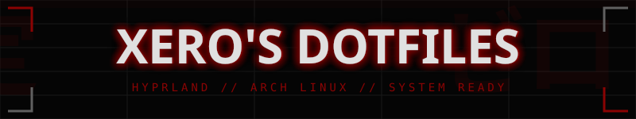

<div align="center">
  
</div>

# Xero's Dotfiles

Arch Linux + Hyprland development environment dotfiles. Optimized for stability, performance, and a clean developer workflow.

Based on [JaKooLit's Hyprland-Dots](https://github.com/JaKooLit/Hyprland-Dots) with custom modifications and fixes.

## Table of Contents

- [Overview](#overview)
- [Screenshots](#screenshots)
- [Requirements](#requirements)
- [Dependencies](#dependencies)
- [Installation](#installation)
- [File Structure](#file-structure)
- [Keybindings](#keybindings)
- [Customization](#customization)
- [Troubleshooting](#troubleshooting)
- [Credits](#credits)

## Overview

This dotfiles repository includes configurations for:

| Component          | Application                          |
| ------------------ | ------------------------------------ |
| **Window Manager** | Hyprland                             |
| **Terminal**       | Kitty, Ghostty                       |
| **Shell**          | Zsh (with Oh-My-Zsh + Powerlevel10k) |
| **Bar**            | Waybar                               |
| **Launcher**       | Rofi (Wayland fork)                  |
| **Notifications**  | SwayNC                               |
| **File Manager**   | Thunar                               |
| **Wallpaper**      | swww + wallust (dynamic theming)     |
| **Lock Screen**    | Hyprlock                             |
| **Idle Daemon**    | Hypridle                             |
| **Multiplexer**    | Tmux                                 |
| **Editor**         | Neovim                               |

## Screenshots

<!-- Add your screenshots here -->

_Screenshots coming soon..._

## Requirements

- **OS**: Arch Linux (or Arch-based distro)
- **Display Server**: Wayland
- **GPU**: Intel/AMD recommended (NVIDIA requires additional configuration)
- **Hyprland**: v0.40+ (tested on latest stable)

## Dependencies

### Quick Install (Arch Linux)

```bash
# Core Hyprland ecosystem
sudo pacman -S hyprland hypridle hyprlock xdg-desktop-portal-hyprland

# Wayland utilities
sudo pacman -S wl-clipboard cliphist grim slurp swappy

# Audio/Media
sudo pacman -S pipewire pipewire-pulse wireplumber pamixer playerctl

# Notifications & Bar
sudo pacman -S swaync waybar rofi-wayland

# System utilities
sudo pacman -S jq polkit-gnome network-manager-applet blueman brightnessctl

# File manager & Terminal
sudo pacman -S thunar kitty

# Theming
sudo pacman -S kvantum qt5ct qt6ct nwg-look nwg-displays

# Fonts
sudo pacman -S ttf-jetbrains-mono-nerd ttf-meslo-nerd otf-font-awesome

# Shell & CLI tools
sudo pacman -S zsh fzf zoxide atuin lsd lazygit tmux neovim

# GTK themes & icons (optional but recommended)
sudo pacman -S papirus-icon-theme
```

### AUR Packages (via yay/paru)

```bash
# Wallpaper tools
yay -S swww wallust

# Extra fonts & tools
yay -S pokemon-colorscripts-git bibata-cursor-theme flat-remix-gtk

# Optional: Quickshell for window overview
yay -S quickshell-git
```

### Full One-Liner Install

```bash
# Pacman packages
sudo pacman -S --needed hyprland hypridle hyprlock xdg-desktop-portal-hyprland \
    wl-clipboard cliphist grim slurp swappy pipewire pipewire-pulse wireplumber \
    pamixer playerctl swaync waybar rofi-wayland jq polkit-gnome \
    network-manager-applet blueman brightnessctl thunar kitty kvantum qt5ct qt6ct \
    nwg-look nwg-displays ttf-jetbrains-mono-nerd ttf-meslo-nerd otf-font-awesome \
    zsh fzf zoxide atuin lsd lazygit tmux neovim papirus-icon-theme

# AUR packages (using yay)
yay -S --needed swww wallust pokemon-colorscripts-git bibata-cursor-theme
```

## Installation

### 1. Clone the Repository

```bash
git clone https://github.com/xero/dotfiles.git ~/dotfiles
cd ~/dotfiles
```

### 2. Backup Existing Configs

```bash
# Backup existing configs
mkdir -p ~/.config-backup
cp -r ~/.config/hypr ~/.config-backup/ 2>/dev/null
cp -r ~/.config/waybar ~/.config-backup/ 2>/dev/null
cp -r ~/.config/rofi ~/.config-backup/ 2>/dev/null
cp -r ~/.config/kitty ~/.config-backup/ 2>/dev/null
cp ~/.zshrc ~/.config-backup/ 2>/dev/null
```

### 3. Create Symlinks

```bash
# Using GNU Stow (recommended)
sudo pacman -S stow
cd ~/dotfiles
stow .

# Or manually symlink
ln -sf ~/dotfiles/.config/* ~/.config/
ln -sf ~/dotfiles/.zshrc ~/.zshrc
ln -sf ~/dotfiles/.zprofile ~/.zprofile
```

### 4. Set Zsh as Default Shell

```bash
chsh -s $(which zsh)
```

### 5. Install Oh-My-Zsh & Plugins

```bash
# Oh-My-Zsh
sh -c "$(curl -fsSL https://raw.githubusercontent.com/ohmyzsh/ohmyzsh/master/tools/install.sh)"

# Powerlevel10k theme
git clone --depth=1 https://github.com/romkatv/powerlevel10k.git ${ZSH_CUSTOM:-$HOME/.oh-my-zsh/custom}/themes/powerlevel10k

# Plugins
git clone https://github.com/z-shell/F-Sy-H.git ${ZSH_CUSTOM:-$HOME/.oh-my-zsh/custom}/plugins/F-Sy-H
git clone https://github.com/zsh-users/zsh-autosuggestions ${ZSH_CUSTOM:-$HOME/.oh-my-zsh/custom}/plugins/zsh-autosuggestions
git clone https://github.com/marlonrichert/zsh-autocomplete.git ${ZSH_CUSTOM:-$HOME/.oh-my-zsh/custom}/plugins/zsh-autocomplete
git clone https://github.com/MichaelAquilina/zsh-you-should-use.git ${ZSH_CUSTOM:-$HOME/.oh-my-zsh/custom}/plugins/you-should-use
```

### 6. Install Tmux Plugin Manager

```bash
git clone https://github.com/tmux-plugins/tpm ~/.tmux/plugins/tpm
# Then press prefix + I (Ctrl-a + I) inside tmux to install plugins
```

### 7. Reboot

```bash
reboot
```

## File Structure

```
dotfiles/
├── .config/
│   ├── hypr/                    # Hyprland configuration
│   │   ├── hyprland.conf        # Main config (sources others)
│   │   ├── hypridle.conf        # Idle daemon config
│   │   ├── hyprlock.conf        # Lock screen config
│   │   ├── configs/
│   │   │   └── Keybinds.conf    # Default keybindings
│   │   ├── UserConfigs/         # User customization (safe to edit)
│   │   │   ├── ENVariables.conf # Environment variables
│   │   │   ├── Startup_Apps.conf# Autostart applications
│   │   │   ├── UserKeybinds.conf# Custom keybindings
│   │   │   ├── UserSettings.conf# Hyprland settings
│   │   │   └── WindowRules.conf # Window rules & tags
│   │   ├── scripts/             # Helper scripts
│   │   └── UserScripts/         # User scripts
│   ├── waybar/                  # Status bar
│   ├── rofi/                    # Application launcher
│   ├── kitty/                   # Terminal emulator
│   ├── swaync/                  # Notification center
│   ├── tmux/                    # Terminal multiplexer
│   └── fastfetch/               # System info display
├── .zshrc                       # Zsh configuration
├── .zprofile                    # Zsh profile
└── README.md                    # This file
```

## Keybindings

### General

| Keybinding             | Action                           |
| ---------------------- | -------------------------------- |
| `SUPER + Return`       | Open terminal (Kitty)            |
| `SUPER + ALT + Return` | Open terminal with tmux attached |
| `SUPER + Q`            | Close active window              |
| `SUPER + D`            | Application launcher (Rofi)      |
| `SUPER + E`            | File manager (Thunar)            |
| `SUPER + B`            | Open default browser             |
| `CTRL + ALT + Delete`  | Exit Hyprland                    |

### Window Management

| Keybinding                   | Action          |
| ---------------------------- | --------------- |
| `SUPER + Arrow Keys`         | Move focus      |
| `SUPER + SHIFT + Arrow Keys` | Resize window   |
| `SUPER + CTRL + Arrow Keys`  | Move window     |
| `SUPER + ALT + Arrow Keys`   | Swap window     |
| `SUPER + SPACE`              | Toggle floating |
| `SUPER + SHIFT + F`          | Fullscreen      |
| `SUPER + CTRL + F`           | Fake fullscreen |

### Workspaces

| Keybinding            | Action                        |
| --------------------- | ----------------------------- |
| `SUPER + 1-0`         | Switch to workspace 1-10      |
| `SUPER + SHIFT + 1-0` | Move window to workspace 1-10 |
| `SUPER + Tab`         | Next workspace                |
| `SUPER + SHIFT + Tab` | Previous workspace            |
| `SUPER + U`           | Toggle special workspace      |
| `SUPER + SHIFT + U`   | Move to special workspace     |

### Utilities

| Keybinding          | Action                        |
| ------------------- | ----------------------------- |
| `SUPER + SHIFT + S` | Screenshot (area) with Swappy |
| `SUPER + Print`     | Screenshot (full)             |
| `SUPER + ALT + V`   | Clipboard manager             |
| `SUPER + H`         | Keybindings cheat sheet       |
| `SUPER + CTRL + L`  | Lock screen                   |
| `SUPER + CTRL + P`  | Power menu (wlogout)          |
| `SUPER + W`         | Wallpaper selector            |
| `SUPER + A`         | Window overview (Quickshell)  |

### Media Keys

| Keybinding              | Action          |
| ----------------------- | --------------- |
| `XF86AudioRaiseVolume`  | Volume up       |
| `XF86AudioLowerVolume`  | Volume down     |
| `XF86AudioMute`         | Toggle mute     |
| `XF86AudioMicMute`      | Toggle mic mute |
| `XF86MonBrightnessUp`   | Brightness up   |
| `XF86MonBrightnessDown` | Brightness down |

## Customization

### Safe Files to Edit

These files are designed for user customization and won't be overwritten:

- `.config/hypr/UserConfigs/UserKeybinds.conf` - Add your keybindings
- `.config/hypr/UserConfigs/UserSettings.conf` - Hyprland settings
- `.config/hypr/UserConfigs/Startup_Apps.conf` - Autostart apps
- `.config/hypr/UserConfigs/WindowRules.conf` - Window rules
- `.config/hypr/UserConfigs/01-UserDefaults.conf` - Default apps

### Changing Wallpaper

```bash
# Interactive selector
SUPER + W

# Or manually with swww
swww img /path/to/wallpaper.jpg --transition-type grow
```

### Changing Themes

- **Rofi Theme**: `SUPER + CTRL + R`
- **Waybar Style**: `SUPER + CTRL + B`
- **Waybar Layout**: `SUPER + ALT + B`
- **GTK Theme**: Use `nwg-look`
- **Qt Theme**: Use `qt5ct` / `qt6ct` and `kvantummanager`

### Monitor Configuration

Use `nwg-displays` for GUI configuration, or edit:

- `.config/hypr/monitors.conf`
- `.config/hypr/workspaces.conf`

## Troubleshooting

### Common Issues

#### Screen tearing or flickering

```bash
# Try disabling VRR in UserSettings.conf
vrr = 0
```

#### Waybar not showing

```bash
# Restart waybar
killall waybar && waybar &
```

#### Rofi not launching

```bash
# Kill existing instance first
pkill rofi; rofi -show drun
```

#### Wallpaper not loading

```bash
# Check if swww-daemon is running
pgrep swww-daemon || swww-daemon &
swww img ~/Pictures/wallpapers/your-wallpaper.jpg
```

#### Audio not working

```bash
# Restart PipeWire
systemctl --user restart pipewire pipewire-pulse wireplumber
```

#### NVIDIA users

Add these to `.config/hypr/UserConfigs/ENVariables.conf`:

```conf
env = LIBVA_DRIVER_NAME,nvidia
env = __GLX_VENDOR_LIBRARY_NAME,nvidia
env = NVD_BACKEND,direct
```

### Reset to Fresh State

```bash
# Remove initial boot marker to re-run setup
rm ~/.config/hypr/.initial_startup_done
# Then logout and login again
```

### Logs

```bash
# Hyprland logs
cat /tmp/hypr/$(ls -t /tmp/hypr/ | head -1)/hyprland.log

# Check for errors
journalctl --user -xe
```

## Environment Variables

Key environment variables configured for development:

| Variable                       | Value                             | Purpose                  |
| ------------------------------ | --------------------------------- | ------------------------ |
| `GDK_BACKEND`                  | wayland,x11,\*                    | GTK apps prefer Wayland  |
| `QT_QPA_PLATFORM`              | wayland;xcb                       | Qt apps prefer Wayland   |
| `ELECTRON_OZONE_PLATFORM_HINT` | auto                              | Electron apps on Wayland |
| `MOZ_ENABLE_WAYLAND`           | 1                                 | Firefox on Wayland       |
| `SSH_AUTH_SOCK`                | $XDG_RUNTIME_DIR/ssh-agent.socket | SSH agent for Git        |
| `_JAVA_AWT_WM_NONREPARENTING`  | 1                                 | Java GUI apps fix        |
| `EDITOR`                       | nvim                              | Default editor           |

## Credits

- [JaKooLit](https://github.com/JaKooLit) - Original Hyprland-Dots base
- [Hyprland](https://hyprland.org/) - The amazing Wayland compositor
- [vaxerski](https://github.com/vaxerski) - Hyprland creator

## License

These dotfiles are provided as-is. Feel free to use, modify, and distribute.

---

**Happy ricing!**

<div align="center">
  
</div>
